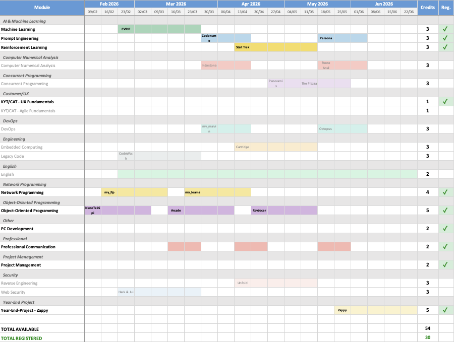

# Epitech Credit Planner

Generate an Excel Gantt timeline of Epitech projects to plan your credit strategy.



## Features

- Visual timeline of all available projects for a semester
- Color-coded categories (AI, Security, DevOps, Web, etc.)
- Credit summary with validated/pending breakdown
- Auto-detection of your registered modules

## Installation

```bash
git clone https://github.com/SachaHenneveux/epitech-planner.git
cd epitech-planner
pip install -e .
```

## Quick Start

```bash
credit-strategy --cookie "YOUR_COOKIE_HERE"
```

## How to Get Your Cookie

The tool needs your Epitech session cookie to access the intranet API.


### Step 1: Open the Intranet

Go to [intra.epitech.eu](https://intra.epitech.eu) and make sure you're logged in.

### Step 2: Open Developer Tools

Press `F12` (Windows/Linux) or `Cmd + Option + I` (Mac)

### Step 3: Go to Network Tab

Click on the **Network** tab in DevTools.

### Step 4: Find a Request

1. Refresh the page (`F5` or `Cmd + R`)
2. In the filter bar, type `format=json` to find API requests
3. Click on any request in the list (e.g., `filter?format=json`)

### Step 5: Copy the Cookie

1. In the right panel, scroll to **Request Headers**
2. Find the line that starts with `Cookie:`
3. Copy the **entire value** after `Cookie:` (it's a very long string)

The cookie looks like this:
```
gdpr=1; user=eyJ0eXAiOiJKV1QiLCJhbGciOiJIUzI1NiJ9...; P7GgJZWSsFOt0iVlj89yqMKdNhE=...
```

> **Important**: The cookie must contain `user=eyJ...` (a JWT token). If it's missing, the authentication will fail.

### Step 6: Run the Tool

```bash
credit-strategy --cookie "gdpr=1; user=eyJ...; ..."
```

## Usage

```bash
# Auto-detect latest semester
credit-strategy -c "YOUR_COOKIE"

# Specific semester
credit-strategy -c "YOUR_COOKIE" -s 4

# Custom output path
credit-strategy -c "YOUR_COOKIE" -o ~/Desktop/planning.xlsx
```

### Options

| Option | Description | Default |
|--------|-------------|---------|
| `-c`, `--cookie` | Session cookie (required) | - |
| `-s`, `--semester` | Semester number (1-10) | Auto-detect |
| `-o`, `--output` | Output Excel file | `output/credit_strategy_S{n}.xlsx` |

## Output

The generated Excel file contains:

- **Timeline**: Weekly Gantt chart of all projects
- **Categories**: Modules grouped by type (AI, Security, DevOps, etc.)
- **Credits**: Credit value for each module
- **Registration status**: Checkmark for modules you're registered in
- **Credit Summary**: Validated/pending credits per semester with year totals

## Troubleshooting

### "Invalid or expired cookie"

Your session has expired. Get a new cookie from the intranet.

### "No modules found"

Check that you specified the correct semester with `-s`.

### Cookie doesn't work

Make sure you copied the **entire** cookie value, including the `user=eyJ...` part. The `user` token is required for authentication.

## License

MIT
